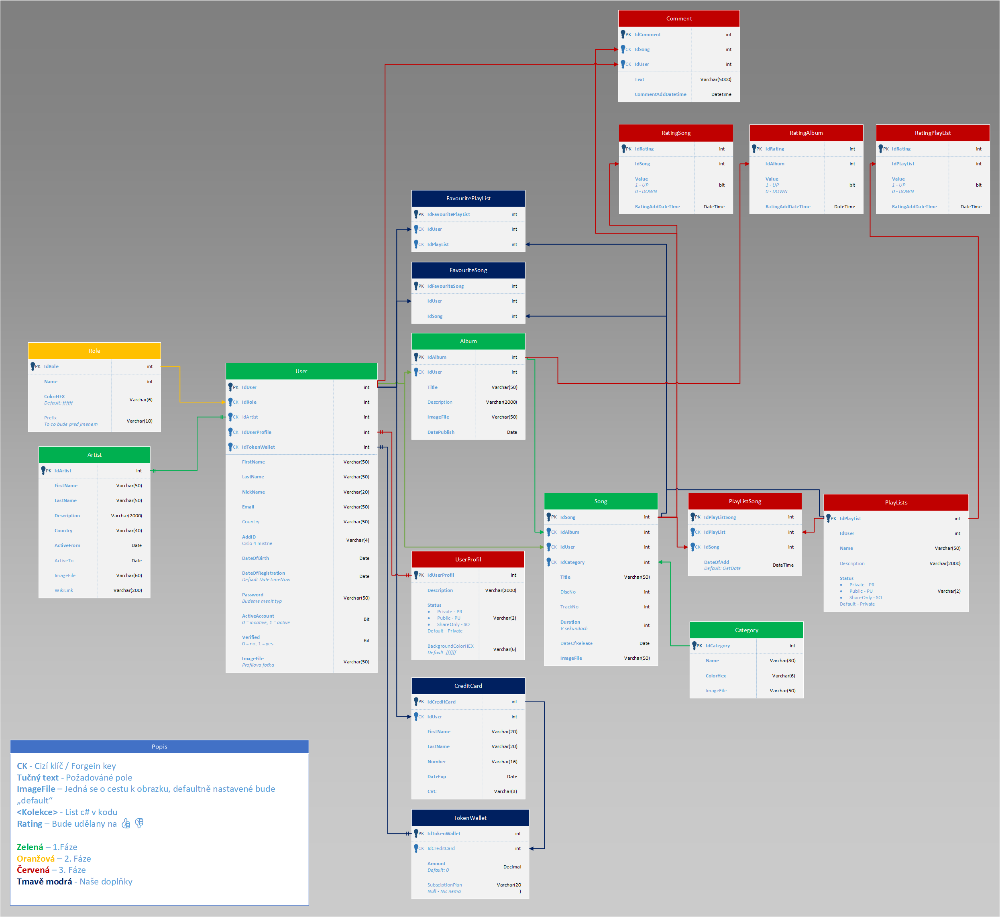

# BetterSpotify

Cílem tohoto projektu bylo vytvořit webovou aplikaci pro přehrávání hudby, která by fungovala odlišně od běžných streamovacích služeb, jako je Spotify.

## Myšlenka

Na rozdíl od Spotify, kde uživatelé platí měsíční předplatné, BetterSpotify využívá systém tokenů. Uživatelé si kupují tokeny, které mohou utrácet za přehrávání skladeb nebo za nahrávání vlastních písní. Autoři hudby získávají tokeny zpět pokaždé, když si někdo přehraje jejich skladbu.

Tento model podporuje komunitní prostředí, kde si každý může vybrat, komu chce přispět. Hlavní výhodou je, že talentovaní začínající hudebníci mají větší šanci vydělat peníze za svou tvorbu.

## Technologie

Během vývoje jsme se zaměřili na práci s následujícími technologiemi:

- **Entity Framework** (správa databáze)
- **MS SQL** (databázový systém)
- **ASP.NET** (backend aplikace)

## Návrh

### Databáze

Projekt byl rozdělen do čtyř fází, během nichž byly postupně přidávány nové funkce. Vývoj byl ukončen mezi druhou a třetí fází.

### Design

Design aplikace byl vytvořen pomocí **Figma**.

## Realizace

Byly implementovány CRUD operace pro:

- **Uživatele**
- **Alba**
- **Skladby**
- **Kategorie**
- **Umělce**

Všechny tyto entity lze filtrovat, upravovat a mazat. Lze k nim nahrávat obrázky a hudební soubory. Každý vstup prochází validací ASP.NET, což zajišťuje správnost zadaných údajů.

> *(Obrázky skladeb nejsou k dispozici, protože web běžel na serveru a soubory ve složce wwwroot nebyly přeneseny.)*

### Editace skladeb

Seznam skladeb

Editace skladby

### Editace uživatelů

## Instalace

1) Naklonujte repozitář.
2) Vytvořte databázi pomocí `WebDatabaseZaloha.sql`.
3) Spusťte projekt.
